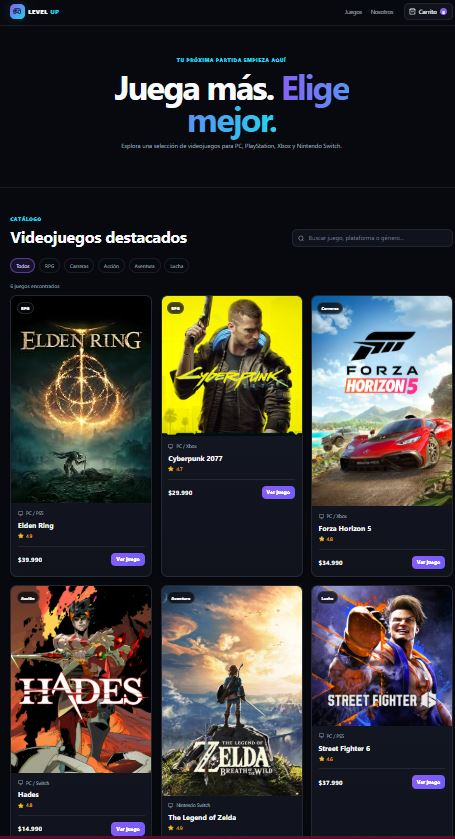
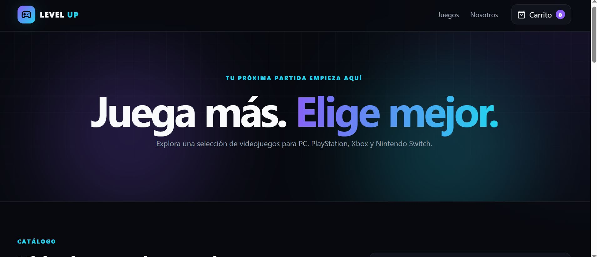
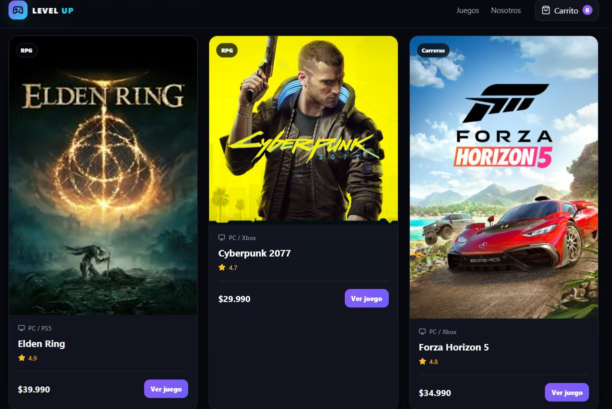
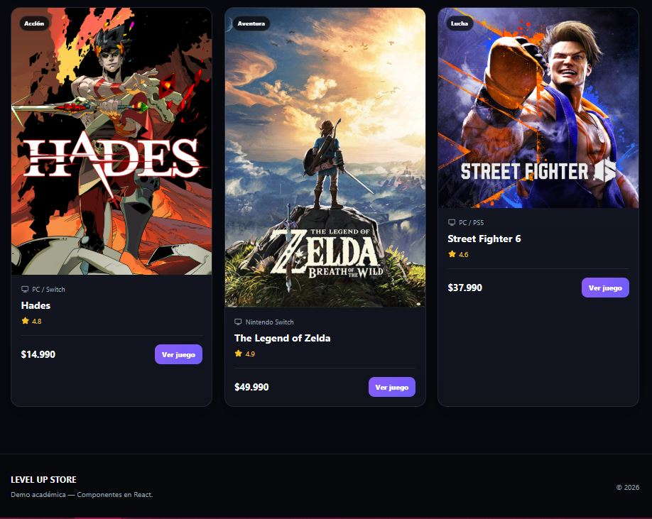
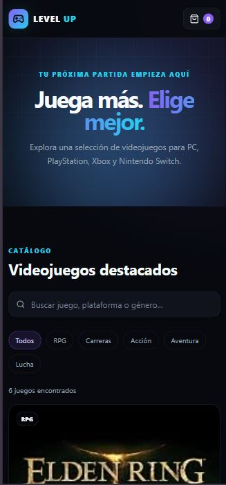
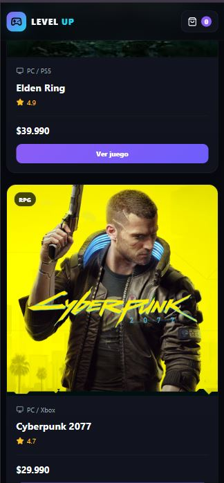

# 🎮 Level Up Store

Proyecto desarrollado para la Evaluación 1 del Módulo 2
del Diplomado Full Stack.

Level Up Store es un e-commerce de videojuegos desarrollado
con React, utilizando componentes reutilizables, props,
estado y datos simulados.


## 🚀 Funcionalidades

- Listado de videojuegos.
- Buscador dinámico.
- Filtro por categorías.
- Cards reutilizables.
- Diseño responsive.
- Datos simulados localmente.


## 🧩 Componentes

El proyecto utiliza los siguientes componentes custom:

- Header
- SearchBar
- ProductCard
- ProductList
- Button
- Footer


## ⚛️ React

Se utilizan conceptos como:

- Componentes.
- Props.
- useState.
- Renderizado con map().
- key para listas.
- Eventos.
- Filtrado de datos.


## 📁 Datos

Los productos están almacenados en:

src/data/products.js

Cada producto contiene:

- id
- name
- price
- category
- image
- platform
- rating


## 🛠️ Tecnologías

- React
- JavaScript
- HTML5
- CSS3
- Vite
- Git
- GitHub


## ▶️ Cómo ejecutar el proyecto

1. Clonar el repositorio:

```bash
git clone https://github.com/OGRodrigo/M2_Evaluacion1.git
```

2. Entrar a la carpeta del proyecto:

```bash
cd M2_Evaluacion1
```

3. Instalar las dependencias:

```bash
npm install
```

4. Ejecutar el proyecto:

```bash
npm run dev
```

5. Abrir en el navegador la dirección indicada por Vite.


## 📸 Capturas de pantalla

### Vista general



### Header



### Cards de productos



### Footer



### Vista Mobile



### Segunda vista Mobile



## 👨‍💻 Autor

Rodrigo Astudillo

Proyecto académico desarrollado para el
Diplomado Full Stack.